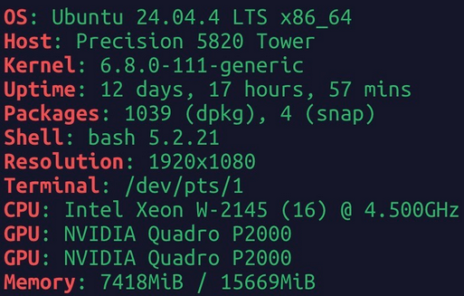

## My Setup & Specs





## My Experience

Self-hosting is an interesting way to apply my skills to a “server” setting. Running applications through Docker, applying networking concepts I’ve been learning, and generally learning about Linux servers has been incredibly rewarding. It’s also really awesome to be able to touch my server from anywhere on earth.

Even though my Precision has dual Quadro P2000’s (Hell yeah), it is not a powerhouse of a machine. Most of the hardware is from 2019ish. It would be cool to upgrade it to 32GB of RAM and my GTX 1080.

## AI on the Precision

Utilizing agents and AI like Claude Code has been rewarding on this device. With remote control, I can create and manage sessions from my phone, making server management flexible. However, Claude’s remote control is limited; sessions must be created manually via SSH and do not persist in the background. Despite this, the setup remains valuable for my workflow.

I am also self-hosting a Llama model on [OpenwebUI](https://docs.openwebui.com/) (likely Llama 3.2, pending confirmation). Though the model is basic, server upgrades could increase its utility. Image generation has been attempted, but the P2000s seem underpowered for such tasks.


## My Plans

In order from sooner -> later

- [x] Selfhost common applications
- [x] Utilize Remote AI Agents
- [ ] Create an externally accessible uptime/resource tracker
- [ ] Create a NAS
- [ ] Upgrade GPU, RAM
- [ ] Selfhost ```jacksonyanek.com```